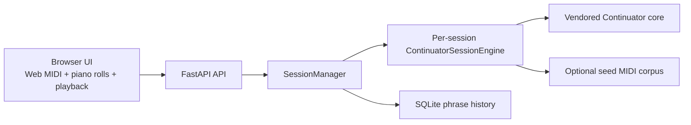

# Web Continuator

This repository packages Continuator as a browser-based instrument and API wrapper.
It lets a user play a MIDI phrase in the browser, send that phrase to a Python Continuator engine, receive a generated continuation, and play it back immediately.

The current implementation is meant as an MVP for experimentation, demos, and architecture validation. It already supports:

- Browser-side real-time MIDI capture with the Web MIDI API.
- A `FastAPI` backend that wraps the Python Continuator engine.
- One isolated Continuator engine per live session.
- SQLite logging for captured and generated phrases.
- A compact UI with MIDI controls, phrase playback, and session activity views.
- A tabbed `History | Memory` activity card.
- Docker packaging suitable for local containers and Hugging Face Docker Spaces.

## Goals

This project is trying to validate a web architecture for Continuator with a clear separation of responsibilities:

- The browser owns the real-time MIDI interaction.
- The Python backend owns phrase learning and generation.
- Session state is isolated so multiple users do not share musical memory by accident.
- Phrase history is stored separately from the live model state.

This is important because the original Continuator codebase is centered on local Python usage, while this project explores a true client-server version with a JavaScript front-end.

## Current Scope

What is implemented today:

- Session creation and reset.
- Web MIDI input selection in the browser.
- Browser sampled piano/violin playback, browser synth playback, or hardware MIDI output playback.
- Optional live MIDI input monitoring through the selected playback renderer.
- Phrase capture based on silence detection.
- Continuator settings exposed through a compact advanced drawer.
- Per-session `History` and `Memory` visualization.

What is intentionally not implemented yet:

- Persistent user accounts.
- Persistent per-user musical memory across sessions.
- Shared session storage across multiple backend instances.
- A production-grade multi-user database architecture.

## Product And UX Overview

The UI is organized around a simple performance loop:

- `Session`: create a new isolated Continuator session or reset its memory.
- `MIDI I/O`: connect browser MIDI, choose an input port, and choose a playback output.
- `Phrase Flow`: monitor captured and generated note counts, send a phrase manually, replay the last continuation, or clear local buffers.
- `Session Activity`: switch between `History` and `Memory`.

The UX principle is to keep the performance flow visible at all times and hide lower-frequency controls behind progressive disclosure:

- High-frequency controls stay on the main surface.
- Advanced model controls live in the `Advanced Continuator Settings` drawer.
- Memory inspection stays inside a local tabbed card rather than taking over the page.

## High-Level Architecture



At a high level:

- The browser captures raw MIDI events in real time.
- The browser segments those events into phrases.
- The backend converts phrase JSON into `mido.Message` objects.
- The session-specific engine learns the phrase and samples a continuation.
- The backend converts the result back to JSON.
- The browser renders and plays the continuation.

## Runtime Pipeline

The phrase pipeline is:

1. A user clicks `Connect MIDI` and chooses a browser MIDI input.
2. The browser receives `note_on` and `note_off` events in real time.
3. The front-end keeps a phrase open while notes are still active.
4. A phrase closes when all notes are released and the selected phrase gap has passed since the final note event. The UI defaults this gap to 1 second after the final `note_off`.
5. The browser stores the captured phrase as JSON with timing deltas.
6. The client sends that JSON to `POST /api/continue`.
7. The backend reconstructs `mido.Message` objects and asks Continuator for a phrase representation.
8. The backend follows the current Continuator strategy: learn the input phrase first, then generate.
9. The backend returns both the input phrase and generated phrase as note-level and event-level JSON payloads.
10. The browser updates the piano rolls, logs the interaction in `History`, refreshes `Memory`, and plays the continuation.

By default, the backend asks for a continuation with the same note count as the input phrase.

For robustness, the wrapper currently retries generation without the hard end constraint if the exact same-length plus exact-ending request has no solution. This helps some dense or chordal phrases without modifying the Continuator core itself.

## Session Model

A session is the main runtime boundary in this application.

Each session contains:

- One in-memory Continuator engine.
- One current settings snapshot.
- Logged phrase history in SQLite.
- A live memory view derived from the engine state.

Changing engine/model controls in the browser stages them until `Apply Settings` is pressed. Switching engine or Markov order `K` requires Apply Settings because the backend rebuilds the live session engine, then restores the existing session memory into the rebuilt engine.

Important distinction:

- `History` is everything that was logged for the session.
- `Memory` is only what is currently active inside the Continuator engine.

Those are not always the same:

- If `forget old phrases` is enabled, some historical phrases may no longer be active in memory.
- If `transpose` is enabled, one learned phrase can appear as several active memory sequences.
- If the backend is restarted, the in-memory engine is rebuilt, while SQLite history remains on disk.

## Memory Model

The `Memory` tab is a visualization of the active engine state for the current session.

It shows:

- Summary chips with the active sequence count and settings.
- A recency ribbon from oldest to newest.
- A list of active memory slots, newest first.

The memory view is based on the Continuator engine's current `input_sequences`, not on the SQLite history log.

If a seed MIDI file or folder is loaded, memory items are labeled as:

- `seed`: sequences learned from the seed corpus at session initialization.
- `live`: sequences learned from browser interaction during the session.

Current limitation:

- This is session memory, not yet user memory.
- There is no persistent musical profile that follows a user across sessions.

## Continuator Settings Exposed In The UI

The advanced drawer currently exposes existing Continuator parameters already present in the original Gradio interface:

- `Learn input`
- `Transpose`
- `Forget old phrases`
- `Keep only N last inputs`
- `Decay mode`

Design choice:

- `Learn input` stays visible because it directly affects performance behavior.
- The other parameters live in the advanced drawer because they are lower-frequency controls.

## Repository Layout

```text
backend/
  app/
    config.py
    continuator_adapter.py
    main.py
    schemas.py
    session_manager.py
    storage.py
  data/
frontend/
  app.js
  index.html
  styles.css
Dockerfile
README.md
```

Main responsibilities:

- `frontend/index.html`: page structure and UI regions.
- `frontend/app.js`: MIDI capture, phrase segmentation, API calls, playback, and client-side visualization.
- `frontend/styles.css`: layout and visual design.
- `backend/app/main.py`: FastAPI routes.
- `backend/app/session_manager.py`: session lifecycle, orchestration, and API-facing session logic.
- `backend/app/continuator_adapter.py`: bridge between web JSON payloads and the Continuator Python engine.
- `backend/app/storage.py`: SQLite session and phrase logging.
- `continuator`: installed Python package providing the Continuator engine.

## API Surface

Current API endpoints:

- `GET /health`: lightweight health check.
- `GET /api/config`: public app-level configuration.
- `POST /api/session`: create a new session and its isolated Continuator engine.
- `PATCH /api/sessions/{session_id}/settings`: update live session settings.
- `POST /api/continue`: send one phrase and request a continuation.
- `POST /api/sessions/{session_id}/generate`: generate a phrase directly from memory.
- `GET /api/sessions/{session_id}/history`: retrieve recent logged phrase history.
- `GET /api/sessions/{session_id}/memory`: retrieve the active memory snapshot for the live engine.
- `POST /api/sessions/{session_id}/reset`: clear the live engine memory while preserving session settings.

API payloads use JSON and expose both:

- event-level timing data for playback
- note-level timing data for visualization
- constraint status, plus optional per-step `generation_trace` diagnostics for engines that expose it

`Generate From Memory` requests both beginning and ending constraints by default
and reports when either constraint has to be relaxed. Infinite-mode chaining uses
the continuation endpoint with the previous phrase as context; its memory
re-seed fallback disables the beginning constraint.

## Local Development

Create a virtual environment, install dependencies, and launch the backend:

```bash
python3 -m venv .venv
source .venv/bin/activate
pip install -r backend/requirements.txt
python -m uvicorn app.main:app --app-dir backend --reload
```

Open:

```text
http://127.0.0.1:8000
```

Recommended browser support:

- Chrome
- Edge

`localhost` is a valid secure context for Web MIDI, so HTTPS is not required for local development.

Typical local interaction:

1. Click `Create Session`.
2. Click `Connect MIDI`.
3. Choose a MIDI input.
4. Choose `Browser Synth` or a hardware output.
5. Optionally open `Advanced Continuator Settings`.
6. Play a phrase.
7. Wait until the selected phrase gap has elapsed after the final note release. The default gap is 1 second.
8. Let auto-send submit the phrase, or click `Send Phrase`.
9. Inspect `History` or `Memory` in the `Session Activity` card.

When you change frontend code, a normal refresh is usually enough.
When you change backend models or routes, restarting the server and refreshing the page is the safest option.

## Configuration

Environment variables currently supported:

- `CONTINUATOR_APP_NAME`: override the displayed app name.
- `CONTINUATOR_DB_PATH`: move the SQLite database to another location.
- `CONTINUATOR_SEED_MIDI_FILE`: preload each new session with one MIDI file.
- `CONTINUATOR_SEED_MIDI_FOLDER`: preload each new session with a folder of MIDI files.

Examples:

```bash
export CONTINUATOR_SEED_MIDI_FILE=/absolute/path/to/example.mid
export CONTINUATOR_DB_PATH=/absolute/path/to/continuator.sqlite3
```

## Optional Seed Corpus

If you want each new session to start from an existing corpus instead of an empty Continuator memory, set one of the seed variables before launching the server:

```bash
export CONTINUATOR_SEED_MIDI_FILE=/absolute/path/to/example.mid
export CONTINUATOR_SEED_MIDI_FOLDER=/absolute/path/to/midi/folder
```

This changes the starting memory of each newly created session, but sessions remain isolated from one another.

## Docker

Build and run locally:

```bash
docker build -t continuator-web .
docker run --rm -p 7860:7860 continuator-web
```

Why the Docker image is simple:

- The frontend is static and does not require a separate Node build.
- The backend serves both the API and static assets.
- The image exposes port `7860`, which matches common Hugging Face Docker Space conventions.

## Deploying To Hugging Face Spaces

This repository is now prepared to be used as a Docker Space.

The YAML block at the top of this `README.md` declares:

- `sdk: docker`
- `app_port: 7860`

Typical deployment flow:

1. Create a new Space on Hugging Face.
2. Choose the `Docker` SDK.
3. Push this repository to the Space repository.
4. Let the Space build automatically from the included `Dockerfile`.

If you want phrase history to survive restarts, attach a storage volume or bucket and mount it at `/data` (or another path), then point the database there with an environment variable such as:

```bash
CONTINUATOR_DB_PATH=/data/continuator.sqlite3
```

If you want each new session to start from a corpus, you can also define:

```bash
CONTINUATOR_SEED_MIDI_FILE=/data/seeds/example.mid
CONTINUATOR_SEED_MIDI_FOLDER=/data/seeds
```

For a first public demo, the simplest deployment is:

- free CPU hardware
- no persistent storage
- no seed corpus

That keeps the setup minimal and is enough to validate browser MIDI capture, API round-trips, and continuation playback.

## Hugging Face Spaces Notes

This repository is shaped for a Docker Space:

- one container
- static frontend
- Python API
- no extra frontend build pipeline

That makes it a good fit for a public demo or lightweight prototype.

Things to keep in mind:

- The current live session registry is in process memory, so scaling to multiple replicas would require shared session storage.
- SQLite is fine for a prototype, but PostgreSQL would be a better next step for heavier concurrent use.
- Persistent user memory is not implemented yet.
- Long-lived or heavier multi-user deployments will need explicit storage, authentication, and horizontal architecture decisions.

## Local Mac Usage After Space Setup

Yes: adding Hugging Face Space metadata does not change the local development workflow.

You can still run the app exactly as before:

```bash
python3 -m venv .venv
source .venv/bin/activate
pip install -r backend/requirements.txt
python -m uvicorn app.main:app --app-dir backend --reload
```

The Hugging Face YAML block is only repository metadata for the Space platform. The local frontend, backend, and Docker workflows continue to work the same way on macOS.

## Current Limitations

- Session engines are in memory only.
- Memory does not survive a backend restart unless re-created from a seed corpus.
- There is no user account layer yet.
- The `Memory` tab shows session memory, not cross-session user memory.
- Web MIDI support depends on browser support and user permission.
- The built-in sampled piano and violin are loaded lazily from the [FluidR3 General MIDI browser soundfont](https://github.com/gleitz/midi-js-soundfonts) on first use.
- The Continuator core is currently treated as a black box from the web wrapper side.

## Roadmap Ideas

Natural next steps for this project:

- Persistent per-user memory across sessions.
- Authentication or signed session tokens.
- A shared session store for multi-instance deployments.
- PostgreSQL instead of SQLite when concurrent writes matter.
- Inline piano-roll thumbnails in the `Memory` list.
- Stronger observability for generation behavior and debugging.
- A richer corpus management workflow for seed material.
